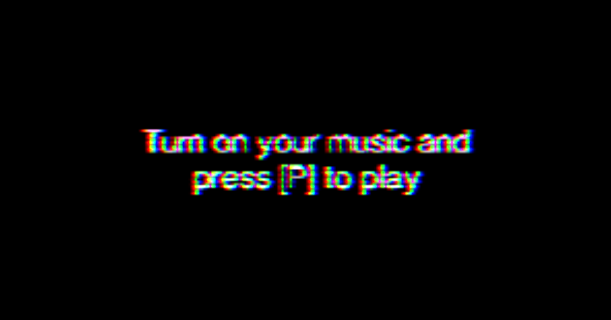

# Raveland

**Raveland** is a complete remake and refactoring of the original "Word Problems" audio visualizer. This project visualizes audio signals in real-time using [Three.js](https://threejs.org/). The goal is to make sounds come alive through interactive and stunning visuals.

## Screenshots

| Intro |
|--|
| |

| App (of course a freezed screen :) |
|--|
|  |


## Features

- 🌊 **Audio Visualization**: Real-time display of frequency bands and sound waves.
- 🎨 **Three.js Integration**: Powerful 3D graphics rendering.
- 🔧 **Modern ES6 Module Setup**: Entirely rewritten using modern JavaScript.
- 🚀 **Vite-Powered**: Fast development and easy build process.

## Prerequisites

- [Node.js](https://nodejs.org/) (version 20.x or higher)
- [npm](https://www.npmjs.com/) (comes with Node.js)

Make sure these tools are installed before you start.

## Installation

Clone the repository and install the dependencies:

```bash
git clone https://github.com/vlrmprjct/raveland.git
cd raveland
npm install
```

## Development

To start the project locally, run:

```bash
npm start
```

The app will be available at [http://localhost:3000](http://localhost:3000). It supports hot-reloading, so changes will be reflected immediately.

## Build

To create a production build, use:

```bash
npm run build
```

This will create an optimized build in the `dist` folder.

## Build Preview

To test the production build, run:

```bash
npm run preview
```

The preview will be available at [http://localhost:8080](http://localhost:8080).

## About This Project

This project is inspired by the original "Word Problems" visualizer, but has been completely rewritten to use modern JavaScript standards and tools like Vite and ES6 modules. The focus was on improving performance, code structure, and maintainability while keeping the core visual experience.

## License

This project is licensed under the [MIT License](LICENSE).

## Issues and Suggestions

If you find a bug or have a suggestion, please open an issue on [GitHub Issues](https://github.com/vlrmprjct/raveland/issues).

## Acknowledgments

- Thanks to [Three.js](https://threejs.org/) for providing a this library for 3D graphics.
- Original inspiration from the "Word Problems" project on [uberviz.io](https://www.uberviz.io).

---
